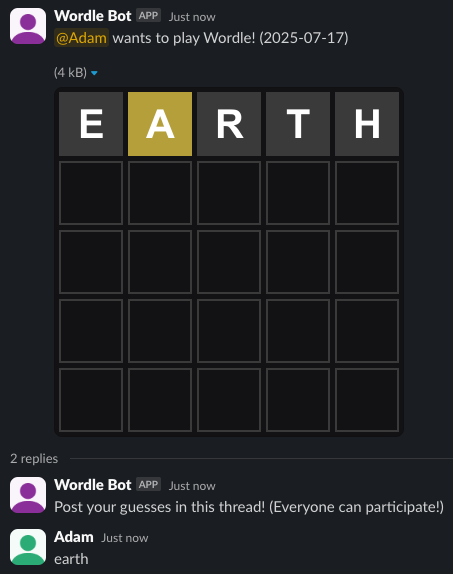

# slack-wordle-bot

Play Wordle in Slack. Written in TypeScript and powered by [Bolt](https://api.slack.com/bolt).

Special thanks to [webrender/slack-wordle](https://github.com/webrender/slack-wordle) for the inspiration to use threads and [Create slackbot using slack bolt API and Node.js](https://medium.com/walmartglobaltech/create-slackbot-using-slack-bolt-api-and-node-js-a82876db012f) for reference in the early stages of the project.

Daily Wordles are retrieved directly from the NYT API.

## Usage within Slack

After installing the app, simply run the `/wordle` command! From there, the bot will reply with the Wordle board, and everyone can guess the word in the thread created by the bot. If this is your first time playing Wordle, consider checking out the [official NYT Wordle game](https://www.nytimes.com/games/wordle/index.html)!



## Self-Hosting

You can also run your own instance of the bot:

### Slack Bot Configuration

First, you will need to [create a Slack app](https://api.slack.com/quickstart#creating).

There are also some specific configurations required:

- Enable [Socket Mode](https://api.slack.com/apis/socket-mode#toggling)
  - This project was built without the expectation of a public HTTP Request URL, and thus the code architecture utilizes Socket Mode.
- Add the following scopes ("OAuth & Permissions" > "Bot Token Scopes"):
  - `channels:history`
    - Allows the bot to read guesses within threads.
  - `chat:write`
    - Allows the bot to reply to guesses within threads.
  - `commands`
    - Allows the bot to create the `/wordle` command.
  - `files:write`
    - Allows the bot to upload the Wordle board images to Slack.

You will need to install the app to your workspace ("Install App") after modifying these values.

### Project Installation

_These instructions require that you have already installed [Git](https://git-scm.com/downloads) and [Node.js](https://nodejs.org/en/download/package-manager)._

```bash
git clone https://github.com/TechPandaPro/slack-wordle-bot.git
cd slack-wordle-bot
npm install
```

### Configuration

Before running the app, you must first create a `.env` file with all the necessary values.

You can copy the example with:

```bash
cp .env.example .env
```

Now that you have the example copied, you can fill in each value within the `.env` file from your [Slack bot](https://api.slack.com/apps).

### Running

After everything is installed and configured, you can run the bot with:

```bash
npm start
```
